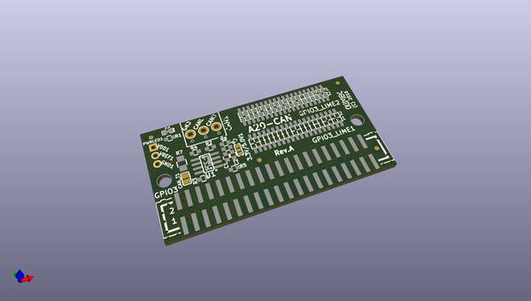
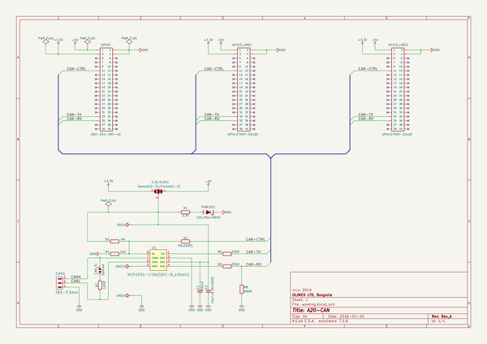

# OOMP Project  
## A20-CAN  by OLIMEX  
  
oomp key: oomp_projects_flat_olimex_a20_can  
(snippet of original readme)  
  
- A20-CAN  
  
CAN driver board for A20-OLinuXino  
  
https://www.olimex.com/wiki/A20-CAN  
  
https://www.olimex.com/Products/OLinuXino/Accessories/A20-CAN/open-source-hardware  
  
  full source readme at [readme_src.md](readme_src.md)  
  
source repo at: [https://github.com/OLIMEX/A20-CAN](https://github.com/OLIMEX/A20-CAN)  
## Board  
  
  
## Schematic  
  
  
  
[schematic pdf](working_schematic.pdf)  
## Images  
