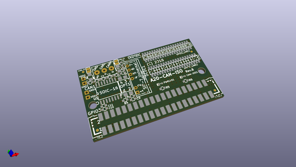
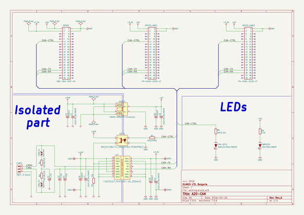

# OOMP Project  
## A20-CAN-ISO  by OLIMEX  
  
(snippet of original readme)  
  
- A20-CAN-ISO  
Galvanic insulated CAN dreiver for A20-OLinuXino Small Linux Computers  
  
Product page: https://www.olimex.com/Products/OLinuXino/A20/A20-CAN-ISO/open-source-hardware  
  
- License  
- Hardware is with CERN OHL v1.2 license  
- Software is with GPL3 license  
- Documentation is with CC BY-SA 4.0 license  
  
  full source readme at [readme_src.md](readme_src.md)  
  
source repo at: [https://github.com/OLIMEX/A20-CAN-ISO](https://github.com/OLIMEX/A20-CAN-ISO)  
## Board  
  
  
## Schematic  
  
  
  
[schematic pdf](working_schematic.pdf)  
## Images  
