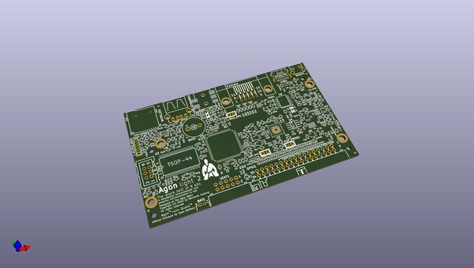

# OOMP Project  
## AgonLight2  by OLIMEX  
  
oomp key: oomp_projects_flat_olimex_agonlight2  
(snippet of original readme)  
  
- AgonLight2  
  
AgonLight OSHW Retro Z80 computer - an updated version with few updates  
  
This is a re-design of the original version of AgonLight made by Bernardo Kastrup: https://github.com/TheByteAttic/AgonLight  
  
What is new:  
- The board schematic and PCB were re-captured and re-layout in KiCad instead of EasyEDA, KiCad is open source software – free to download and use, it is a more fitting CAD tool for an Open Source Hardware project;  
- The power of the original AgonLight is delivered through USB-A connector. We decided to replace it with USB-C connector which is used in all new phones, tablets, and devices due to the new EU directive. Usually everyone has such a cable at home to charge and transfer files to their cell phone;  
- The linear voltage regulator is replaced with DCDC which delivers up to 2A current;  
- Battery Li-Po charger and step-up converter were added, this keeps the board fully operational even if the external power supply gets disconnected;  
- The original design has a PS2 connector for a keyboard and required a USB to PS2 adapter to operate with the more available USB keyboards. We replaced the PS2 connector with a USB-A connector so a normal USB keyboard (which supports PS2) can be directly plugged-in to AgonLight;  
- AS7C34096A-10TCTR SRAM is routed with 40 ohm impedance lines as per the datasheet;  
- Fixed a signal naming in the ESP32-PICO-D4, which now is updated in the original AgonLight documentation;  
- The bare header 32-pin connector is replaced with   
  full source readme at [readme_src.md](readme_src.md)  
  
source repo at: [https://github.com/OLIMEX/AgonLight2](https://github.com/OLIMEX/AgonLight2)  
## Board  
  
  
## Schematic  
  
  
  
[schematic pdf](working_schematic.pdf)  
## Images  
