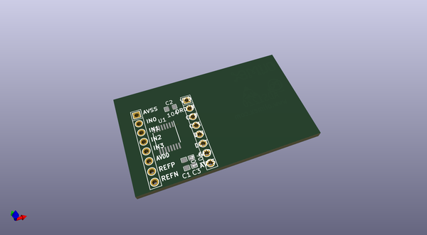
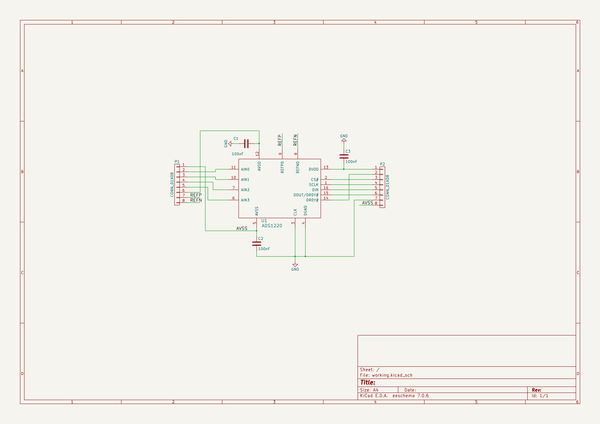

# OOMP Project  
## BB-ADS1220  by OLIMEX  
  
(snippet of original readme)  
  
- BB-ADS1220  
OSHW Open Source Hardware breakboard for ADS1220 Low Power Preciese 24-bit ADC from Texas Instruments  
  
-- Licensee  
* Hardware is released under CERN Open Hardware Licence Version 2 -  
Strongly Reciprocal  
* Software is released under GPL3 Licensee  
* Documentation is released under CC BY-SA 3.0  
  
  full source readme at [readme_src.md](readme_src.md)  
  
source repo at: [https://github.com/OLIMEX/BB-ADS1220](https://github.com/OLIMEX/BB-ADS1220)  
## Board  
  
  
## Schematic  
  
  
  
[schematic pdf](working_schematic.pdf)  
## Images  
