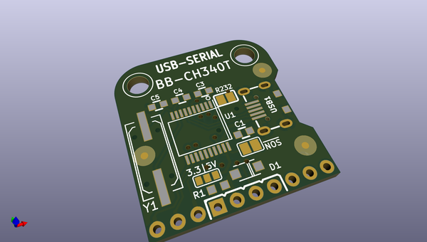
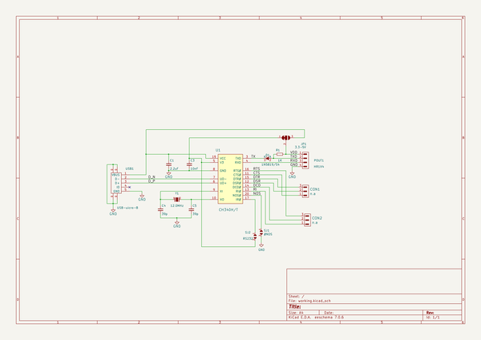

# OOMP Project  
## BB-CH340T  by OLIMEX  
  
oomp key: oomp_projects_flat_olimex_bb_ch340t  
(snippet of original readme)  
  
- BB-CH340T  
  
OSHW USB to serial converter with CH340  
  
The board and schematic files are created with KiCad.  
  
Product page: https://www.olimex.com/Products/Breadboarding/BB-CH340T/open-source-hardware  
  
-- Licensee  
* Hardware is released under CERN Open Hardware Licence Version 2 -  
Strongly Reciprocal  
* Software is released under GPL3 Licensee  
* Documentation is released under CC BY-SA 3.0  
  
  full source readme at [readme_src.md](readme_src.md)  
  
source repo at: [https://github.com/OLIMEX/BB-CH340T](https://github.com/OLIMEX/BB-CH340T)  
## Board  
  
  
## Schematic  
  
  
  
[schematic pdf](working_schematic.pdf)  
## Images  
