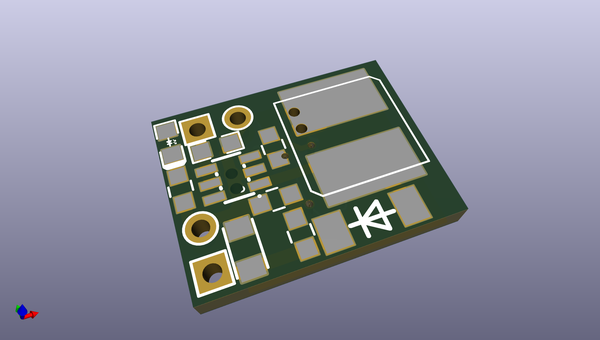
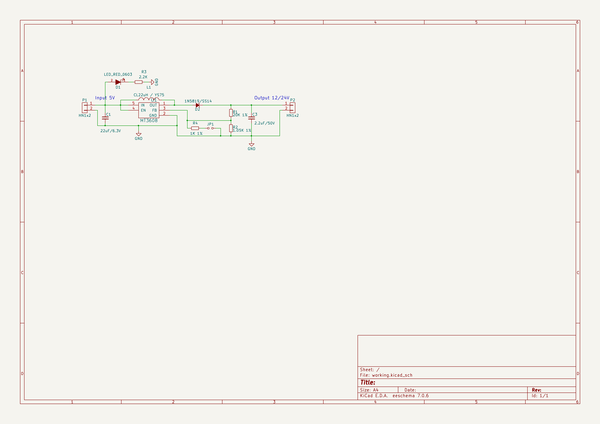

# OOMP Project  
## BB-PWR-3608  by OLIMEX  
  
(snippet of original readme)  
  
- BB-PWR-2608  
KiCAD DCDC OpenSource Hardware Power board for breadboarding Input 5V output 12/1A or 24V/0.5A  
  
  full source readme at [readme_src.md](readme_src.md)  
  
source repo at: [https://github.com/OLIMEX/BB-PWR-3608](https://github.com/OLIMEX/BB-PWR-3608)  
## Board  
  
  
## Schematic  
  
  
  
[schematic pdf](working_schematic.pdf)  
## Images  
