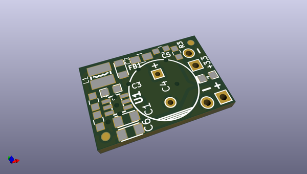
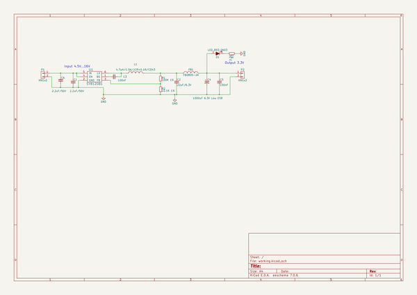

# OOMP Project  
## BB-PWR-8113  by OLIMEX  
  
oomp key: oomp_projects_flat_olimex_bb_pwr_8113  
(snippet of original readme)  
  
- BB-PWR-8113  
KiCAD DCDC OpenSource Hardware Power board for breadboarding Input 4.5-16V output 3.3V / 3A  
  
  full source readme at [readme_src.md](readme_src.md)  
  
source repo at: [https://github.com/OLIMEX/BB-PWR-8113](https://github.com/OLIMEX/BB-PWR-8113)  
## Board  
  
  
## Schematic  
  
  
  
[schematic pdf](working_schematic.pdf)  
## Images  
