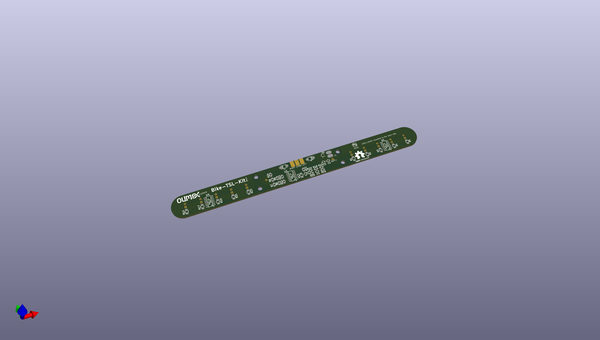
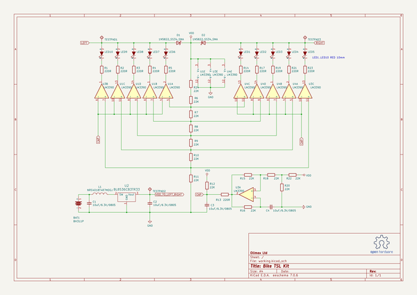

# OOMP Project  
## Bike-TSL-Kit  by OLIMEX  
  
(snippet of original readme)  
  
- Bike-TSL-Kit  
  
[Bike-TSL-Kit](https://www.olimex.com/Products/Soldering-Kits/Bike-TSL-Kit/open-source-hardware) is soldering kit which adds Audi style turn signal lights to your bike.  
  
  
  
- License  
- Hardware is with CERN OHL v1.2 license  
- Documentation is with CC BY-SA 4.0 license  
  
  full source readme at [readme_src.md](readme_src.md)  
  
source repo at: [https://github.com/OLIMEX/Bike-TSL-Kit](https://github.com/OLIMEX/Bike-TSL-Kit)  
## Board  
  
  
## Schematic  
  
  
  
[schematic pdf](working_schematic.pdf)  
## Images  
