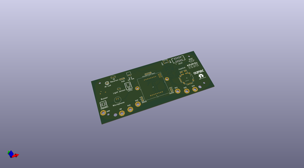
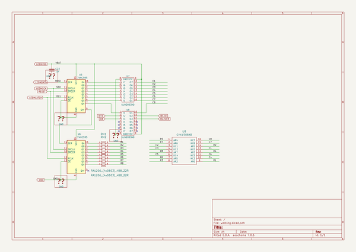

# OOMP Project  
## eduArdu  by OLIMEX  
  
(snippet of original readme)  
  
- eduArdu  
Open Source Hardware Educational board based on Arduino Leonardo  
  
Product page: https://www.olimex.com/Products/Duino/AVR/eduArdu/open-source-hardware  
  
Introduction video: https://youtu.be/3kFrveMF56s  
  
- Getting started  
  
-- Arduino IDE  
  
* [Download and install Arduino IDE](https://www.arduino.cc/en/Main/Software)  
* Open Arduino IDE  
* Click **Sketch > Include Library > Add .ZIP library...** and add all libraries provided with this repository  
* Open a sketch, compile and upload it to Olimex eduArdu  
  
-- Licensee  
* Hardware is released under Apache 2.0 Licensee  
* Software is released under GPL3 Licensee  
* Documentation is released under CC BY-SA 3.0  
  
  full source readme at [readme_src.md](readme_src.md)  
  
source repo at: [https://github.com/OLIMEX/eduArdu](https://github.com/OLIMEX/eduArdu)  
## Board  
  
  
## Schematic  
  
  
  
[schematic pdf](working_schematic.pdf)  
## Images  
