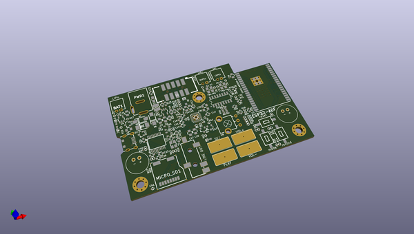

# OOMP Project  
## ESP32-ADF  by OLIMEX  
  
(snippet of original readme)  
  
- ESP32-ADF  
ESP32 Audio Development Framework development board  
  
[ESP32-ADF product page](https://www.olimex.com/Products/IoT/ESP32/ESP32-ADF/)  
  
- ESP32-ADF board has these features:  
- ESP32-WROVER-B module with 8MB PSRAM, 4MB Flash  
- Stereo codec and Audio Amplifier 2x3W  
- Stereo Microphones  
- Audio out 3.5mm jack  
- UEXT connector for sensors and LCDs  
- Lipo battery charger  
- USB connector and programmer  
- Four touch buttons, 3 tactile buttons  
- power supply Jack for +5V 1A  
  
- License  
- Hardware is with CERN OHL v1.2 license  
- Software is with GPL3 license  
- Documentation is with CC BY-SA 4.0 license  
  
  
  full source readme at [readme_src.md](readme_src.md)  
  
source repo at: [https://github.com/OLIMEX/ESP32-ADF](https://github.com/OLIMEX/ESP32-ADF)  
## Board  
  
  
## Schematic  
  
  
  
[schematic pdf](working_schematic.pdf)  
## Images  
