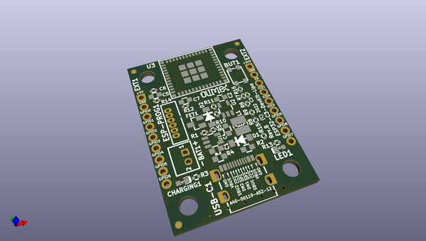

# OOMP Project  
## ESP32-C3-DevKit-Lipo  by OLIMEX  
  
oomp key: oomp_projects_flat_olimex_esp32_c3_devkit_lipo  
(snippet of original readme)  
  
- ESP32-C3-DevKit-Lipo  
ESP32-C3-DevKit-Lipo RISC-V development board with USB, JTAG, WIFI, BT5, LiPo battery charger  
  
Product page: https://www.olimex.com/Products/IoT/ESP32-C3/ESP32-C3-DevKit-Lipo/open-source-hardware  
  
-- License  
* Hardware is released under CERN Open Hardware Licence Version 2 - Strongly Reciprocal https://spdx.org/licenses/CERN-OHL-S-2.0.html  
* Software is released under GPL3 License  
* Documentation is released under CC BY-SA 3.0 https://creativecommons.org/licenses/by-sa/3.0/  
  
  
  
  full source readme at [readme_src.md](readme_src.md)  
  
source repo at: [https://github.com/OLIMEX/ESP32-C3-DevKit-Lipo](https://github.com/OLIMEX/ESP32-C3-DevKit-Lipo)  
## Board  
  
  
## Schematic  
  
  
  
[schematic pdf](working_schematic.pdf)  
## Images  
