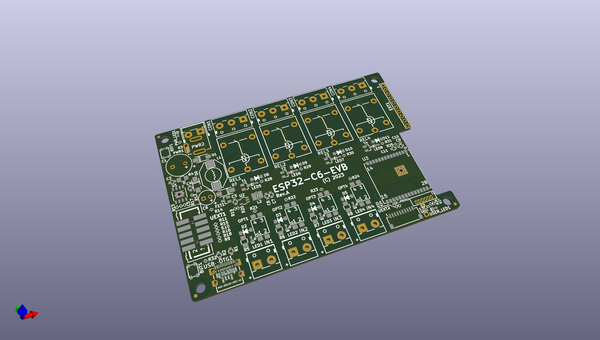

# OOMP Project  
## ESP32-C6-EVB  by OLIMEX  
  
(snippet of original readme)  
  
- ESP32-C6-EVB  
ESP32-C6-EVB is evaluation board with WiFi6, Bluetooth 5LE and Zigbee Matter support  
  
Product page: https://www.olimex.com/Products/IoT/ESP32-C6/ESP32-C6-EVB/open-source-hardware  
-- License  
* Hardware is released under CERN OHL v1.2 license  
* Software is released under GPL3 License  
* Documentation is released under CC BY-SA 3.0  
  full source readme at [readme_src.md](readme_src.md)  
  
source repo at: [https://github.com/OLIMEX/ESP32-C6-EVB](https://github.com/OLIMEX/ESP32-C6-EVB)  
## Board  
  
  
## Schematic  
  
  
  
[schematic pdf](working_schematic.pdf)  
## Images  
