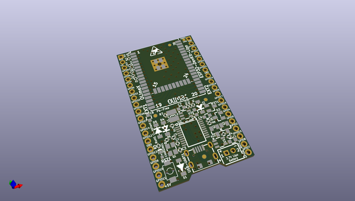

# OOMP Project  
## ESP32-DevKit-LiPo  by OLIMEX  
  
(snippet of original readme)  
  
- ESP32-DevKit-LiPo  
Open Source Hardware OSHW ESP32 development board designed with KiCAD to be pin to pin compatible with Espressif ESP32-DevKitC, but with additional LiPo charger and battery  
  
-- License  
* Hardware is released under Apache 2.0 License  
* Software is released under GPL3 License  
* Documentation is released under CC BY-SA 3.0  
  
  full source readme at [readme_src.md](readme_src.md)  
  
source repo at: [https://github.com/OLIMEX/ESP32-DevKit-LiPo](https://github.com/OLIMEX/ESP32-DevKit-LiPo)  
## Board  
  
  
## Schematic  
  
  
  
[schematic pdf](working_schematic.pdf)  
## Images  
