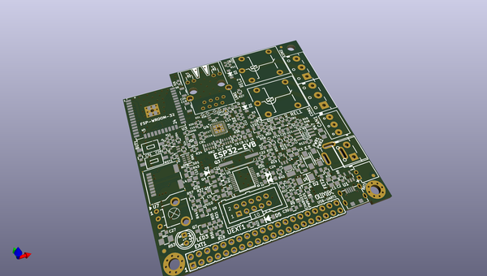

# OOMP Project  
## ESP32-EVB  by OLIMEX  
  
(snippet of original readme)  
  
- ESP32-EVB  
  
ESP32 wifi / BLE development board with Ethernet, relays, microSD card, CAN, infrared, Li-Po charger, GPIOs.  
  
Product page: https://www.olimex.com/Products/IoT/ESP32/ESP32-EVB/open-source-hardware  
  
Open-source hardware board made with open-source CAD software. Comes with either ESP32-WROOM-32E or ESP32-WROOM-32UE module, depending on variant. Board vairants are:  
  
| Board variant | ESP32 module  | External antenna  | Temperature range |  
| ------------- | ------------- | -------------  | ------------- |  
| ESP32-EVB     | ESP32-WROOM-32E  | No  | 0-70°C  |  
| ESP32-EVB-EA  | ESP32-WROOM-32UE  | Yes  | 0-70°C  |  
| ESP32-EVB-EA-IND  | ESP32-WROOM-32UE  | Yes  | -40+85°C |  
| ESP32-EVB-IND  | ESP32-WROOM-32E  | No  | -40+85°C |  
  
ESP32-EVB - ESP32-WROOM-32E module, no external antenna, commercial temeprature range 0-70°C  
  
ESP32-EVB-EA - ESP32-WROOM-32UE module, fitting external antenna, commercial temeprature range 0-70°C  
  
ESP32-EVB-EA-IND - ESP32-WROOM-32UE module, fitting external antenna, industrial temeprature range -40+85°C  
  
ESP32-EVB-IND - ESP32-WROOM-32E module, no external antenna, industrial temeprature range -40+85°C  
  
You can find design hardware sources, schematic exports, BOMs, and more, in the "HARDWARE" folder.  
  
You can find ESP-IDF and Arduino IDE examples, in the "SOFTWARE" folder.  
  
- FAQ  
  
---  
  
**Q:** I have some trouble downloading my code to ESP32-EVB. Is there a way to force boot mode?  
  
**A:** By default the board comes without BOOT button functioanlity  
  full source readme at [readme_src.md](readme_src.md)  
  
source repo at: [https://github.com/OLIMEX/ESP32-EVB](https://github.com/OLIMEX/ESP32-EVB)  
## Board  
  
  
## Schematic  
  
  
  
[schematic pdf](working_schematic.pdf)  
## Images  
