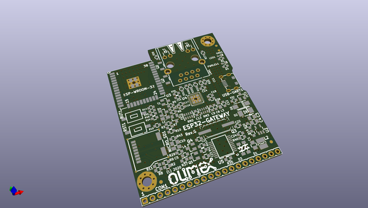

# OOMP Project  
## ESP32-GATEWAY  by OLIMEX  
  
oomp key: oomp_projects_flat_olimex_esp32_gateway  
(snippet of original readme)  
  
- ESP32-GATEWAY  
ESP32 WiFi / BLE development board with Ethernet, microSD card, GPIOs made with KiCAD  
  
  full source readme at [readme_src.md](readme_src.md)  
  
source repo at: [https://github.com/OLIMEX/ESP32-GATEWAY](https://github.com/OLIMEX/ESP32-GATEWAY)  
## Board  
  
  
## Schematic  
  
  
  
[schematic pdf](working_schematic.pdf)  
## Images  
