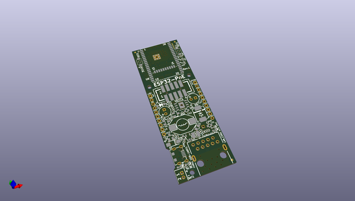
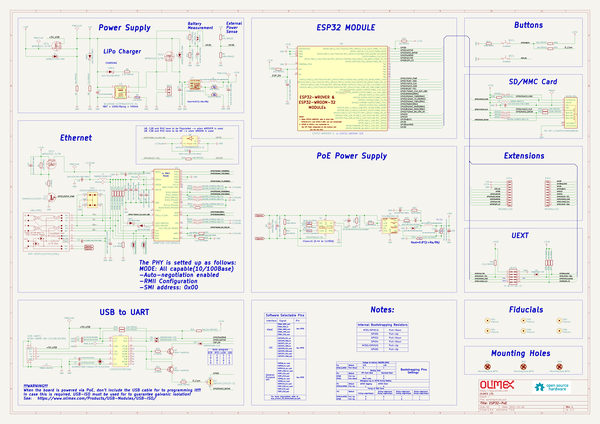

# OOMP Project  
## ESP32-POE  by OLIMEX  
  
(snippet of original readme)  
  
- ESP32-POE  
  
ESP32-PoE is an IoT WIFI/BLE/Ethernet development board with Power-Over-Ethernet feature.  
  
The Si3402-B chip is IEEE 802.3-compliant, including pre-standard (legacy) PoE support.   
  
Perfect solution for Internet-of-Things that can be expanded with sensors and actuators taking power from Ethernet cable.  
  
Low-power design consuming less then 100uA in deep sleep mode!  
  
Product page: https://www.olimex.com/Products/IoT/ESP32/ESP32-POE/open-source-hardware  
  
-- License  
* Hardware is released under Apache 2.0 License  
* Software is released under GPL3 License  
* Documentation is released under CC BY-SA 3.0  
  
  full source readme at [readme_src.md](readme_src.md)  
  
source repo at: [https://github.com/OLIMEX/ESP32-POE](https://github.com/OLIMEX/ESP32-POE)  
## Board  
  
  
## Schematic  
  
  
  
[schematic pdf](working_schematic.pdf)  
## Images  
