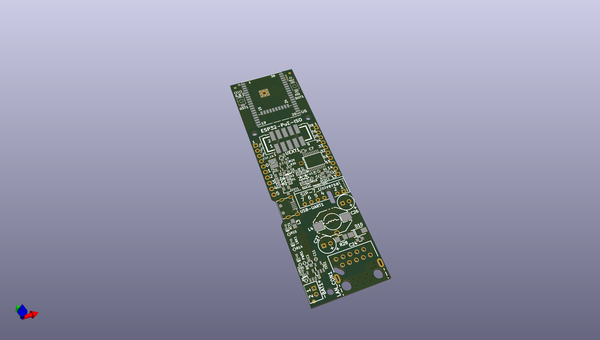
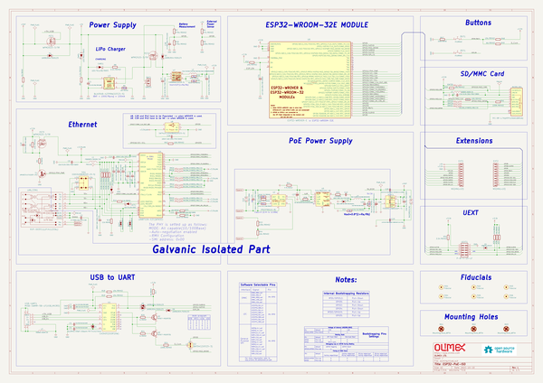

# OOMP Project  
## ESP32-POE-ISO  by OLIMEX  
  
(snippet of original readme)  
  
- ESP32-POE-ISO  
  
ESP32-PoE-ISO is an IoT WIFI/BLE/Ethernet development board with Power-Over-Ethernet feature. The Si3402-B chip is IEEE 802.3-compliant, including pre-standard (legacy) PoE support. Perfect solution for Internet-of-Things that can be expanded with sensors and actuators taking power from Ethernet cable.  
  
ESP32-POE-ISO has 3000VDC galvanic insulation from the Ethernet.  
  
  
Product page: https://www.olimex.com/Products/IoT/ESP32/ESP32-POE-ISO/open-source-hardware  
  
LICENSEE:  
  
ESP32-POE-ISO is Open Source Hardware as per OSHWA.org definition. It is distributed with CERN OSH Licensee v1.2 which is available in the root directory of this repository.  
  
The software examples for ESP32-POE-ISO are distributed with GPL v3 Licensee.  
  
  full source readme at [readme_src.md](readme_src.md)  
  
source repo at: [https://github.com/OLIMEX/ESP32-POE-ISO](https://github.com/OLIMEX/ESP32-POE-ISO)  
## Board  
  
  
## Schematic  
  
  
  
[schematic pdf](working_schematic.pdf)  
## Images  
