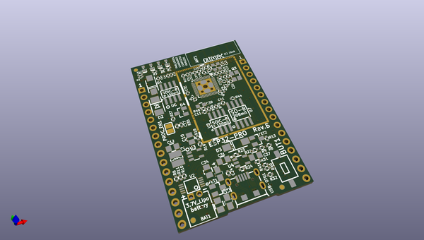
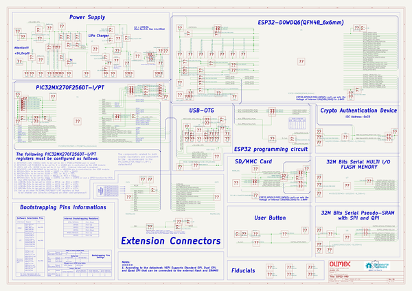

# OOMP Project  
## ESP32-PRO  by OLIMEX  
  
oomp key: oomp_projects_flat_olimex_esp32_pro  
(snippet of original readme)  
  
- ESP32-PRO  
Open-source hardware ESP32 IoT board with 4MB external RAM, 4MB external flash, LiPo charger, USB-OTG, external crypto engine option. The board uses PIC32 as USB-serial converter.   
  
Product page:  
  
https://www.olimex.com/Products/IoT/ESP32/ESP32-PRO/open-source-hardware  
  
  full source readme at [readme_src.md](readme_src.md)  
  
source repo at: [https://github.com/OLIMEX/ESP32-PRO](https://github.com/OLIMEX/ESP32-PRO)  
## Board  
  
  
## Schematic  
  
  
  
[schematic pdf](working_schematic.pdf)  
## Images  
