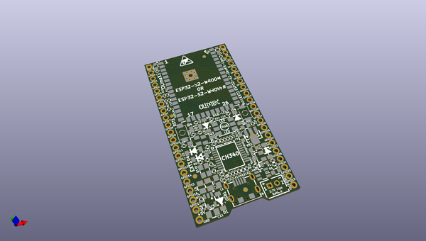
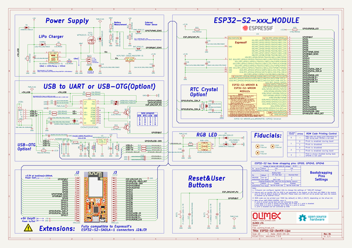

# OOMP Project  
## ESP32-S2-DevKit-LiPo  by OLIMEX  
  
(snippet of original readme)  
  
- ESP32-S2-DevKit-LiPo  
ESP32-S2 IoT developement board with WiFi, USB programmer, RGB LED, LiPo charger, GPIOs  
  
Product page: https://www.olimex.com/Products/IoT/ESP32/ESP32-DevKit-LiPo/open-source-hardware  
  
-- License  
* Hardware is released under CERN Open Hardware Licence Version 2 -  
Strongly Reciprocal  
* Software is released under GPL3 Licensee  
* Documentation is released under CC BY-SA 3.0  
  
  full source readme at [readme_src.md](readme_src.md)  
  
source repo at: [https://github.com/OLIMEX/ESP32-S2-DevKit-LiPo](https://github.com/OLIMEX/ESP32-S2-DevKit-LiPo)  
## Board  
  
  
## Schematic  
  
  
  
[schematic pdf](working_schematic.pdf)  
## Images  
