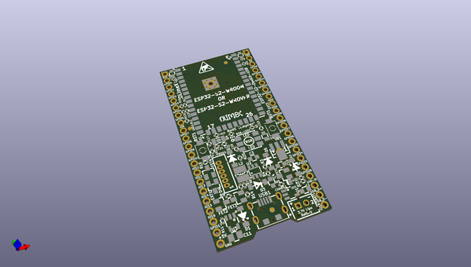
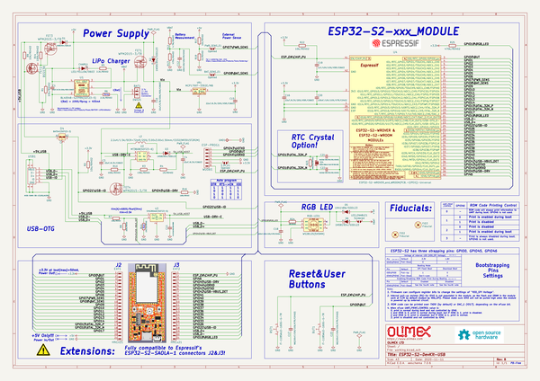

# OOMP Project  
## ESP32-S2-DevKit-LiPo-USB  by OLIMEX  
  
(snippet of original readme)  
  
- ESP32-S2-DevKit-LiPo-USB  
ESP32-S2 development board with native USB-OTG, the hardware supports both USB host and USB device functionality, LiPo battery charger and step up for handheld battery operation.  
   
  
Product page: https://www.olimex.com/Products/IoT/ESP32-S2/ESP32-S2-DevKit-Lipo-USB/open-source-hardware  
-- License  
* Hardware is released under CERN OHL v1.2 license  
* Software is released under GPL3 License  
* Documentation is released under CC BY-SA 3.0  
  
  
  full source readme at [readme_src.md](readme_src.md)  
  
source repo at: [https://github.com/OLIMEX/ESP32-S2-DevKit-LiPo-USB](https://github.com/OLIMEX/ESP32-S2-DevKit-LiPo-USB)  
## Board  
  
  
## Schematic  
  
  
  
[schematic pdf](working_schematic.pdf)  
## Images  
