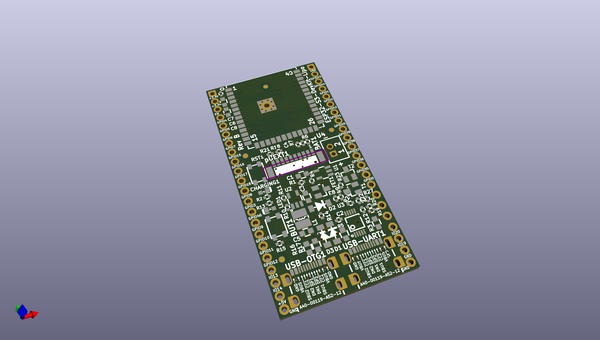

# OOMP Project  
## ESP32-S3-DevKit-LiPo  by OLIMEX  
  
(snippet of original readme)  
  
- ESP32-S3-DevKit-LiPo  
ESP32-S3 development board with JTAG/USB-OTG and LiPo charger  
  
  
  
ESP32-S3-DevKit-LiPo is small board capable to run Linux kernel 6.3  
  
  
  
-- Features  
  
* ESP32-S3-WROOM-1-N8R8 8MB RAM 8 MB Flash  
* Green Status LED  
* Yellow Charge LED  
* pUEXT connector  
* USB-C power supply and USB-Serial programmer  
* USB-C OTG JTAG/Serial connector  
* LiPo charger  
* LiPo battery connector  
* External power sense  
* Battery measurement  
* Automatic power supply switch between USB and LiPo  
* RESET button  
* USER button  
  
-- Licenses  
  
* Hardware is released under CERN Open Hardware Licence Version 2 - Strongly Reciprocal, all silkscreen credits to Olimex should remain;  
* Software is released under GPL3 Licensee  
* Documentation is released under CC BY-SA 3.0  
  full source readme at [readme_src.md](readme_src.md)  
  
source repo at: [https://github.com/OLIMEX/ESP32-S3-DevKit-LiPo](https://github.com/OLIMEX/ESP32-S3-DevKit-LiPo)  
## Board  
  
  
## Schematic  
  
  
  
[schematic pdf](working_schematic.pdf)  
## Images  
