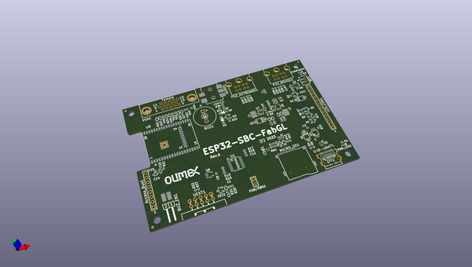

# OOMP Project  
## ESP32-SBC-FabGL  by OLIMEX  
  
oomp key: oomp_projects_flat_olimex_esp32_sbc_fabgl  
(snippet of original readme)  
  
- ESP32-SBC-FabGL  
ESP32-WROVER board working with FabGL library  
  
Software used our fork of FabGL: https://github.com/OLIMEX/FabGL  
  
Product page: https://www.olimex.com/Products/Retro-Computers/ESP32-SBC-FabGL/open-source-hardware  
  
-- License  
* Hardware is released under CERN OHL v1.2 license  
* Software is released under GPL3 License  
* Documentation is released under CC BY-SA 3.0  
  
  full source readme at [readme_src.md](readme_src.md)  
  
source repo at: [https://github.com/OLIMEX/ESP32-SBC-FabGL](https://github.com/OLIMEX/ESP32-SBC-FabGL)  
## Board  
  
  
## Schematic  
  
  
  
[schematic pdf](working_schematic.pdf)  
## Images  
