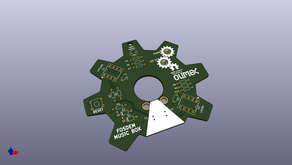
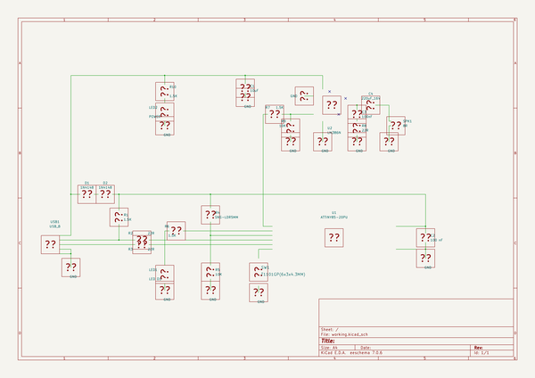

# OOMP Project  
## FOSDEM-MUSIC-BOX  by OLIMEX  
  
(snippet of original readme)  
  
- FOSDEM-MUSIC-BOX  
  
Soldering kit programmable with Arduino IDE to play music  
  
Product page: https://www.olimex.com/Products/Soldering-Kits/FOSDEM-MUSIC-BOX/open-source-hardware  
  
-- License  
* Hardware is with CERN OHL v1.2 license  
* Software is released under GPL3 License  
* Documentation is released under CC BY-SA 3.0  
  
  full source readme at [readme_src.md](readme_src.md)  
  
source repo at: [https://github.com/OLIMEX/FOSDEM-MUSIC-BOX](https://github.com/OLIMEX/FOSDEM-MUSIC-BOX)  
## Board  
  
  
## Schematic  
  
  
  
[schematic pdf](working_schematic.pdf)  
## Images  
