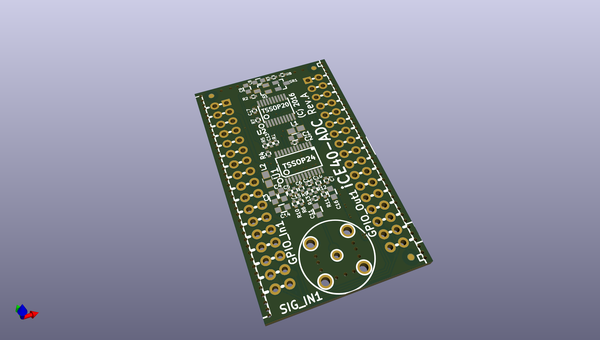
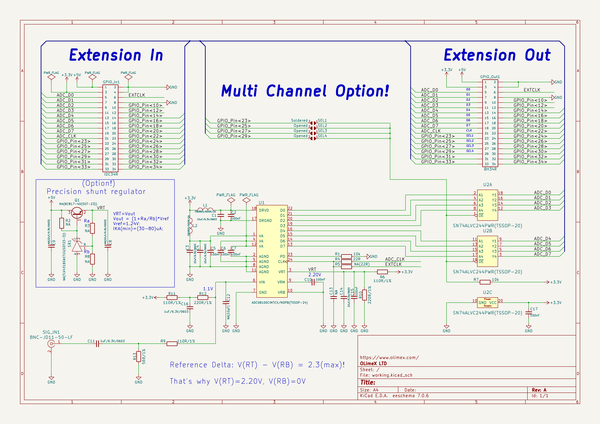

# OOMP Project  
## iCE40-ADC  by OLIMEX  
  
(snippet of original readme)  
  
- iCE40-ADC  
Extension module for iCE40HX1K-EVB or iCE40HX8K-EVB.  
  
Adds fast Analog-Digital-Converter (ADC) functionality to the main board.  
  
You can effectively use up to 4 x iCE40-ADC with a single EVB board (or up to 2 x iCE40-ADC   
when you have iCE40-IO connected to the same bus).  
  
You can use the exported PDFs to access the schematic or the bill of materials.   
  
We used the latest KiCad night builds to create the design. Please use a new version KiCad to open it.   
  
License information should be found in LICENSE.txt  
  
  full source readme at [readme_src.md](readme_src.md)  
  
source repo at: [https://github.com/OLIMEX/iCE40-ADC](https://github.com/OLIMEX/iCE40-ADC)  
## Board  
  
  
## Schematic  
  
  
  
[schematic pdf](working_schematic.pdf)  
## Images  
