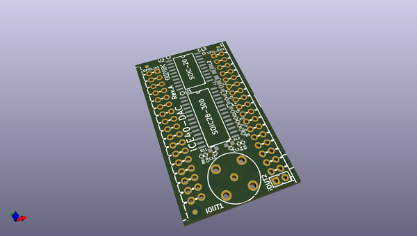

# OOMP Project  
## iCE40-DAC  by OLIMEX  
  
(snippet of original readme)  
  
- iCE40-DAC  
Extension module for iCE40HX1K-EVB or iCE40HX8K-EVB.  
  
Adds fast Digital-Analog-Converter (DAC) functionality to the main board.  
  
You can effectively use up to 4 x iCE40-DAC with a single EVB board (or up to 2 x iCE40-DAC when you have iCE40-IO connected to the same bus).  
  
You can use the exported PDFs to access the schematic or the bill of materials.   
  
We used the latest KiCad night builds to create the design. Please use a new version KiCad to open it.   
  
License information should be found in LICENSE.txt  
  
-- Hardware revision changes:  
  
--- Hardware revision A1  
  
- Changed resistor changing R9 to 0R (down from 10k), this is done because EXTIO was not properly grounded leading to wrong levels  
  
  full source readme at [readme_src.md](readme_src.md)  
  
source repo at: [https://github.com/OLIMEX/iCE40-DAC](https://github.com/OLIMEX/iCE40-DAC)  
## Board  
  
  
## Schematic  
  
  
  
[schematic pdf](working_schematic.pdf)  
## Images  
