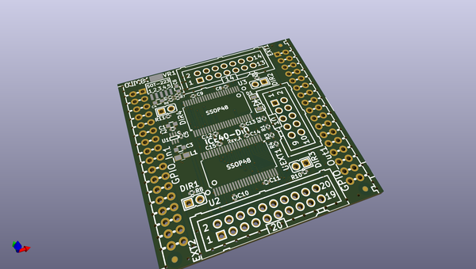
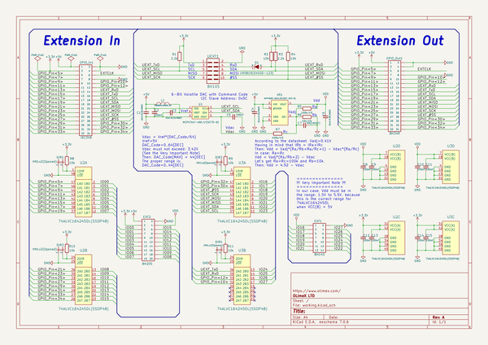

# OOMP Project  
## iCE40-DIO  by OLIMEX  
  
(snippet of original readme)  
  
- iCE40-DIO  
Extension module for iCE40HX1K-EVB or iCE40HX8K-EVB.  
  
iCE40-DIO adds 28 GPIOs to existing iCE40 boards. These signals can be set as inputs or outputs.   
The boards has a programmable DAC which can set the input voltage logic from 1.65 to 5.5V.  
  
You can use the exported PDFs to access the schematic or the bill of materials.   
  
We used the latest KiCad night builds to create the design. Please use a new version KiCad to open it.   
  
License information should be found in LICENSE.txt  
  
  full source readme at [readme_src.md](readme_src.md)  
  
source repo at: [https://github.com/OLIMEX/iCE40-DIO](https://github.com/OLIMEX/iCE40-DIO)  
## Board  
  
  
## Schematic  
  
  
  
[schematic pdf](working_schematic.pdf)  
## Images  
