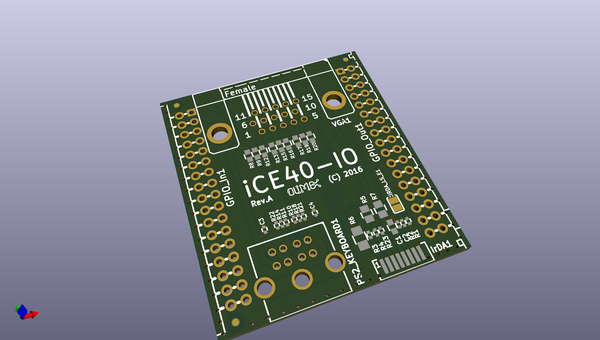
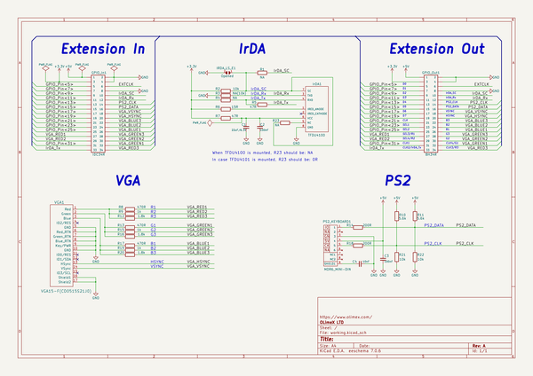

# OOMP Project  
## iCE40-IO  by OLIMEX  
  
oomp key: oomp_projects_flat_olimex_ice40_io  
(snippet of original readme)  
  
- iCE40-IO  
  
Extension module for iCE40HX1K-EVB or iCE40HX8K-EVB.  
  
It is meant to make the input and output easier - the module provides video output connector VGA DE-15;   
keyboard connector PS2; infra red chip TFDU4100 for IrDA connectivity.  
  
Typically, you would need only a signle iCE40-IO module in your setup. Using an iCE40-IO would reduce  
the number of ADC and DAC expansion modules that you can use with a single iCE40HX1K-EVB or iCE40HX8K-EVB board.  
  
  full source readme at [readme_src.md](readme_src.md)  
  
source repo at: [https://github.com/OLIMEX/iCE40-IO](https://github.com/OLIMEX/iCE40-IO)  
## Board  
  
  
## Schematic  
  
  
  
[schematic pdf](working_schematic.pdf)  
## Images  
