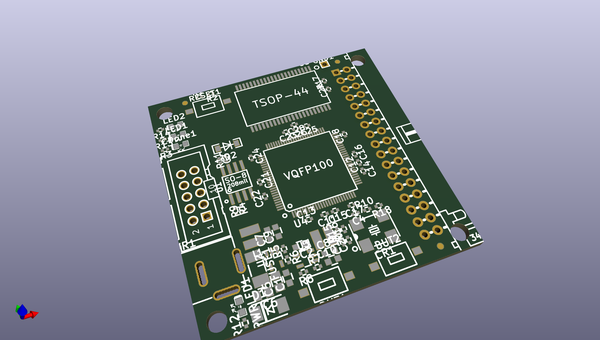
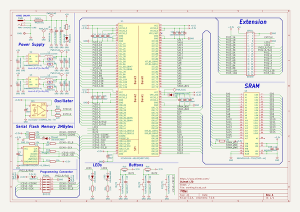

# OOMP Project  
## iCE40HX1K-EVB  by OLIMEX  
  
oomp key: oomp_projects_flat_olimex_ice40hx1k_evb  
(snippet of original readme)  
  
- iCE40HX1K-EVB  
FPGA development board made with KiCAD  
  
  full source readme at [readme_src.md](readme_src.md)  
  
source repo at: [https://github.com/OLIMEX/iCE40HX1K-EVB](https://github.com/OLIMEX/iCE40HX1K-EVB)  
## Board  
  
  
## Schematic  
  
  
  
[schematic pdf](working_schematic.pdf)  
## Images  
