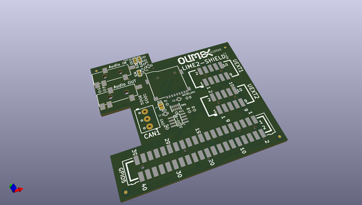
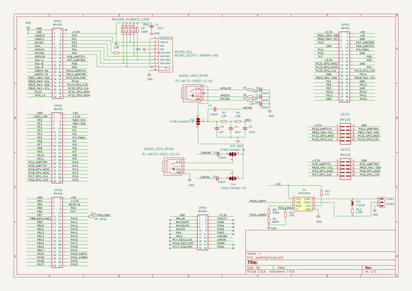

# OOMP Project  
## LIME2-SHIELD  by OLIMEX  
  
oomp key: oomp_projects_flat_olimex_lime2_shield  
(snippet of original readme)  
  
- LIME2-SHIELD  
Shield for A20-OLinuXino-LIME2 which adds Audio, CAN, microSD-card, 2x UEXT, CAN  
  
Product page: https://www.olimex.com/Products/OLinuXino/A20/LIME2-SHIELD/open-source-hardware  
  
-- Licensee  
* Hardware is released under CERN Open Hardware Licence Version 2 -  
Strongly Reciprocal  
* Software is released under GPL3 Licensee  
* Documentation is released under CC BY-SA 3.0  
  
  full source readme at [readme_src.md](readme_src.md)  
  
source repo at: [https://github.com/OLIMEX/LIME2-SHIELD](https://github.com/OLIMEX/LIME2-SHIELD)  
## Board  
  
  
## Schematic  
  
  
  
[schematic pdf](working_schematic.pdf)  
## Images  
