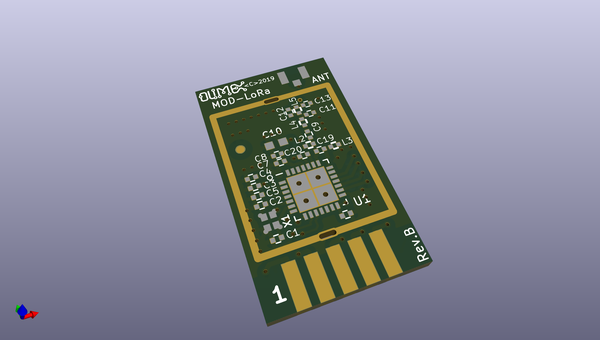
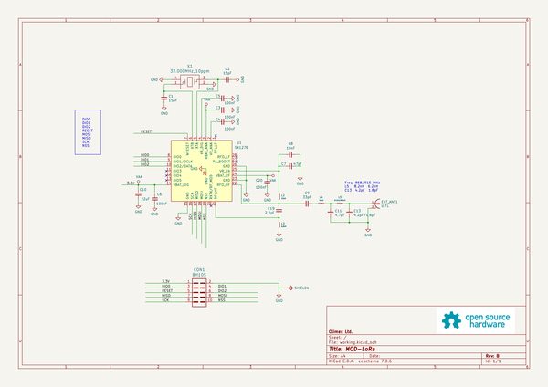

# OOMP Project  
## LoRa-868-915  by OLIMEX  
  
(snippet of original readme)  
  
- LoRa868 / LoRa915 / MOD-LoRa868 / MOD-LoRa915  
  
LoRa modules with SX1276 modem from Semtech.  
  
Product page: https://www.olimex.com/Products/IoT/LoRa/LoRa868/open-source-hardware  
  
Product page: https://www.olimex.com/Products/IoT/LoRa/LoRa915/open-source-hardware  
  
Product page: https://www.olimex.com/Products/IoT/LoRa/MOD-LoRa868/open-source-hardware  
  
Product page: https://www.olimex.com/Products/IoT/LoRa/MOD-LoRa915/open-source-hardware  
  
  
-- License  
* Hardware design is released under CERN OHL v1.2 license  
* Software is released under GPL3 License  
* Documentation is released under CC BY-SA 3.0  
  
  
  full source readme at [readme_src.md](readme_src.md)  
  
source repo at: [https://github.com/OLIMEX/LoRa-868-915](https://github.com/OLIMEX/LoRa-868-915)  
## Board  
  
  
## Schematic  
  
  
  
[schematic pdf](working_schematic.pdf)  
## Images  
