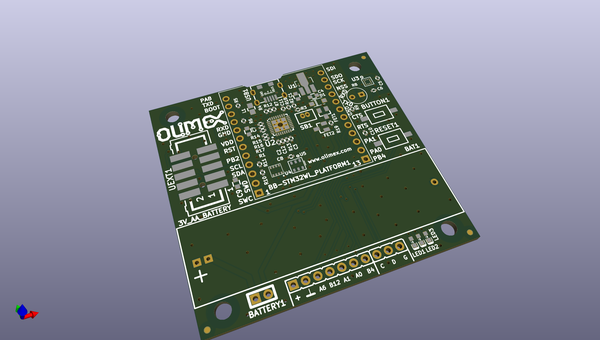

# OOMP Project  
## LoRa-STM32WL-DevKIT  by OLIMEX  
  
(snippet of original readme)  
  
- LoRa-STM32WL-DevKIT  
STM32WL SOC LoRa / LoRaWAN development board with JTAG debugger and sensors for light, temperature, humidity, pressure, 3-axis digital magnetometer  
  
Product page: https://www.olimex.com/Products/IoT/LoRa/LoRa-STM32WL-DevKit/  
  
-- License  
* Hardware design is released under CERN OHL v1.2 license  
* Software is released under GPL3 License  
* Documentation is released under CC BY-SA 3.0  
  
  
  full source readme at [readme_src.md](readme_src.md)  
  
source repo at: [https://github.com/OLIMEX/LoRa-STM32WL-DevKIT](https://github.com/OLIMEX/LoRa-STM32WL-DevKIT)  
## Board  
  
  
## Schematic  
  
  
  
[schematic pdf](working_schematic.pdf)  
## Images  
