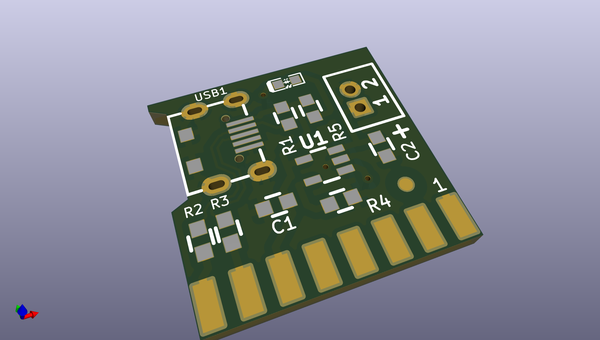

# OOMP Project  
## Minibot  by OLIMEX  
  
oomp key: oomp_projects_flat_olimex_minibot  
(snippet of original readme)  
  
- Minibot  
Small Educational Robot programmable with Arduino, with two motors and sensors to follow line or escape from labyrinth  
  
-- LICENSE  
* Software License is GPL3  
* Hardware License is Apache 2.0  
* Documentation License is CC-BY-SA3.0 (https://creativecommons.org/licenses/by-sa/3.0/)  
  
  full source readme at [readme_src.md](readme_src.md)  
  
source repo at: [https://github.com/OLIMEX/Minibot](https://github.com/OLIMEX/Minibot)  
## Board  
  
  
## Schematic  
  
  
  
[schematic pdf](working_schematic.pdf)  
## Images  
