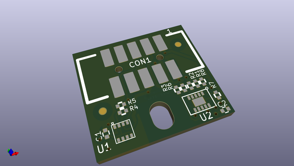
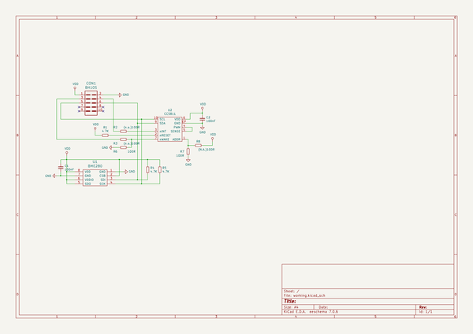

# OOMP Project  
## MOD-ENV  by OLIMEX  
  
oomp key: oomp_projects_flat_olimex_mod_env  
(snippet of original readme)  
  
- MOD-ENV  
Digital Environmental Sensor for CO2 indoor air quality, temperature, humidity, air pressure  
  
-- License  
  
* Software License is GPL3  
* Hardware License is CERN OHL v1.2  
* Documentation is released under CC BY-SA 3.0  
  
  full source readme at [readme_src.md](readme_src.md)  
  
source repo at: [https://github.com/OLIMEX/MOD-ENV](https://github.com/OLIMEX/MOD-ENV)  
## Board  
  
  
## Schematic  
  
  
  
[schematic pdf](working_schematic.pdf)  
## Images  
