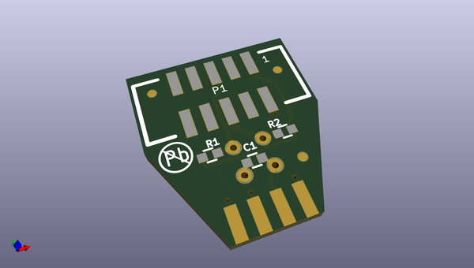
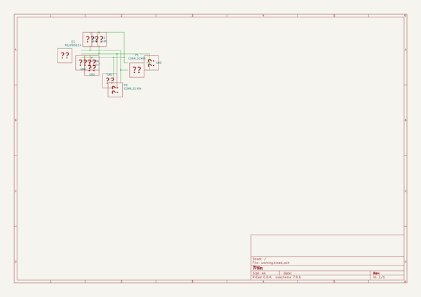

# OOMP Project  
## MOD-IR-TEMP  by OLIMEX  
  
oomp key: oomp_projects_flat_olimex_mod_ir_temp  
(snippet of original readme)  
  
- MOD-IR-TEMP  
MOD-IR-TEMP is non contact high precision temperature measurement module with I2C/UEXT interface  
  
  full source readme at [readme_src.md](readme_src.md)  
  
source repo at: [https://github.com/OLIMEX/MOD-IR-TEMP](https://github.com/OLIMEX/MOD-IR-TEMP)  
## Board  
  
  
## Schematic  
  
  
  
[schematic pdf](working_schematic.pdf)  
## Images  
