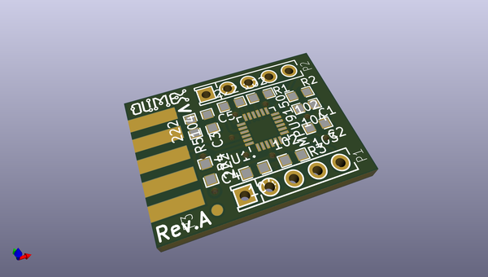
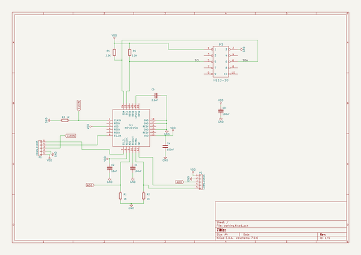

# OOMP Project  
## MOD-MPU9150  by OLIMEX  
  
(snippet of original readme)  
  
- MOD-MPU9150  
UEXT OSHW board - 9-axis motion tracker with 3-axis gyroscope 3-axis accelerometer and 3-axis magnetometer  
  
  full source readme at [readme_src.md](readme_src.md)  
  
source repo at: [https://github.com/OLIMEX/MOD-MPU9150](https://github.com/OLIMEX/MOD-MPU9150)  
## Board  
  
  
## Schematic  
  
  
  
[schematic pdf](working_schematic.pdf)  
## Images  
