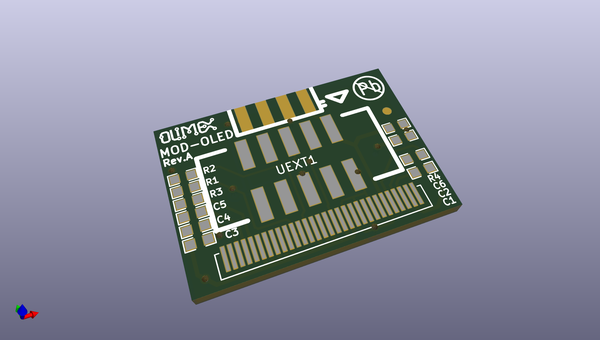
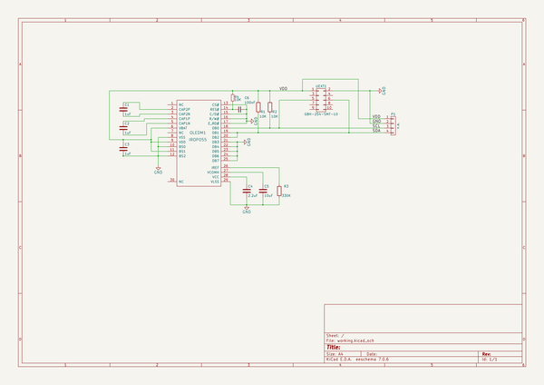

# OOMP Project  
## MOD-OLED-128x64  by OLIMEX  
  
oomp key: oomp_projects_flat_olimex_mod_oled_128x64  
(snippet of original readme)  
  
- MOD-OLED-128x64  
MOD-OLED-128x64 is low power OLED display module with UEXT connector.  
  
  full source readme at [readme_src.md](readme_src.md)  
  
source repo at: [https://github.com/OLIMEX/MOD-OLED-128x64](https://github.com/OLIMEX/MOD-OLED-128x64)  
## Board  
  
  
## Schematic  
  
  
  
[schematic pdf](working_schematic.pdf)  
## Images  
