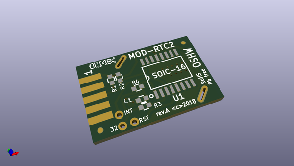
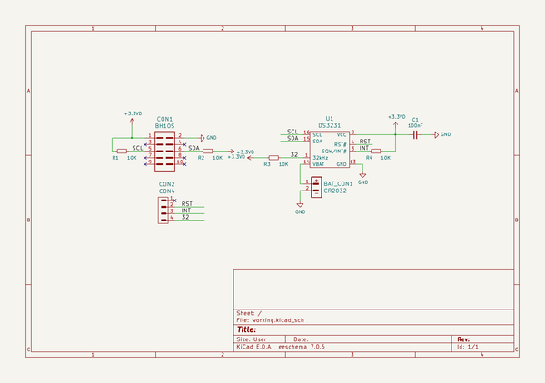

# OOMP Project  
## MOD-RTC2  by OLIMEX  
  
oomp key: oomp_projects_flat_olimex_mod_rtc2  
(snippet of original readme)  
  
- MOD-RTC2  
Extremly accurate RTC UEXT module to connect to Arduino and Linux boards  
  
  full source readme at [readme_src.md](readme_src.md)  
  
source repo at: [https://github.com/OLIMEX/MOD-RTC2](https://github.com/OLIMEX/MOD-RTC2)  
## Board  
  
  
## Schematic  
  
  
  
[schematic pdf](working_schematic.pdf)  
## Images  
