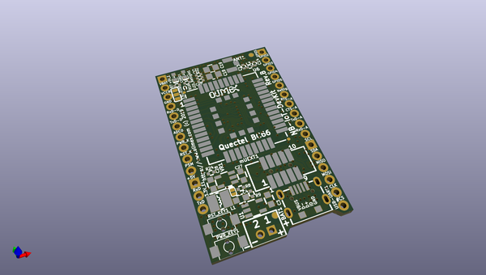
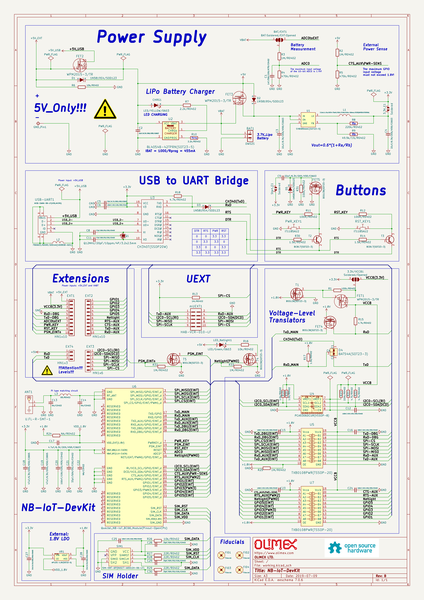

# OOMP Project  
## NB-IoT  by OLIMEX  
  
(snippet of original readme)  
  
- NB-IoT  
NB-IoT is LPWAN technology for IoT with many advantages over LoRa and SigFox.  
  
NB-IoT technology works over existing GSM network. This means all existing GSM networks with LTE can support NB-IoT if the protocol is installed by your GSM operator.  
One base cell can talk up to 100 000 NB-IoT nodes. One base cell can establish connection in urban area 1-10km and in rural area 10-100km  
One NB-IoT node can last on battery up to 10 years if less 200 bytes per day are transmitted  
  
- NB-IoT-DevKit board has these features:  
- BC-66 all world wide GSM bands coverage  
- NB-IoT 25.5 kbps up and down link  
- Ultra low power design  
- Build in Li-Po battery charger  
- Nano SIM  
- Level shifters for 5x GPIOs, I2C, SPI, UART  
- Micro UEXT connector  
- U.FL antenna connector  
- Status LEDs  
- Dimensions 40x25 mm  
  
- License  
- Hardware is with CERN OHL v1.2 license  
- Software is with GPL3 license  
- Documentation is with CC BY-SA 4.0 license  
  
  full source readme at [readme_src.md](readme_src.md)  
  
source repo at: [https://github.com/OLIMEX/NB-IoT](https://github.com/OLIMEX/NB-IoT)  
## Board  
  
  
## Schematic  
  
  
  
[schematic pdf](working_schematic.pdf)  
## Images  
