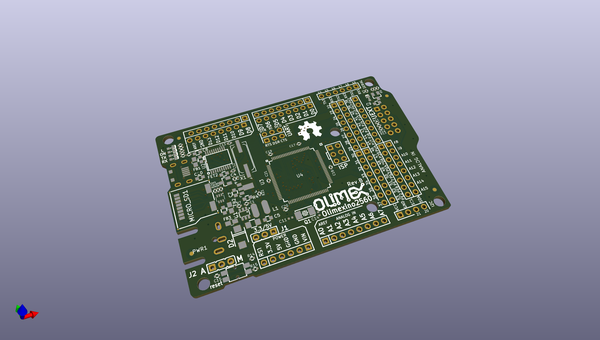
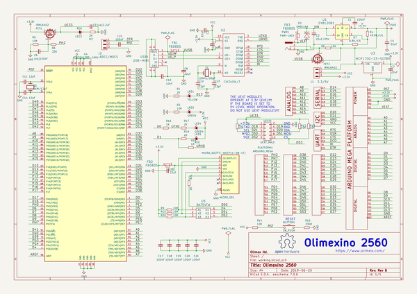

# OOMP Project  
## OLIMEXINO-2560  by OLIMEX  
  
oomp key: oomp_projects_flat_olimex_olimexino_2560  
(snippet of original readme)  
  
- OLIMEXINO-2560  
Arduino Mega 2560 like board with ATMEGA2560 processor, 88 GPIOs, uSD card, 6-15VDC power  
  
-- License  
* Software Licensee is GPL 3.0  
* Hardware Licensee is CERN Open Hardware Licence v1.2  
* Documentation is released under CC BY-SA 3.0  
  
  full source readme at [readme_src.md](readme_src.md)  
  
source repo at: [https://github.com/OLIMEX/OLIMEXINO-2560](https://github.com/OLIMEX/OLIMEXINO-2560)  
## Board  
  
  
## Schematic  
  
  
  
[schematic pdf](working_schematic.pdf)  
## Images  
