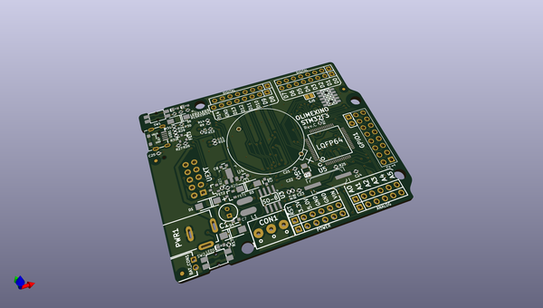
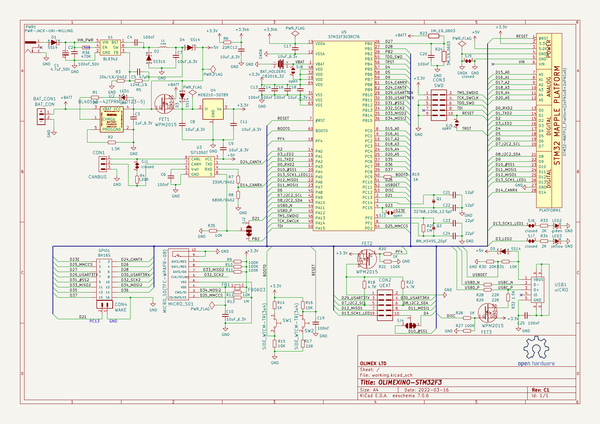
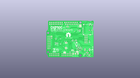
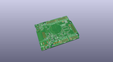
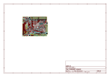
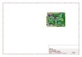
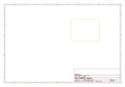
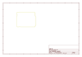
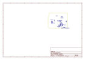
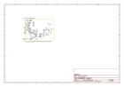

# OOMP Project  
## OLIMEXINO-STM32F3  by OLIMEX  
  
(snippet of original readme)  
  
- OLIMEXINO-STM32F3  
Industrial grade -40+85C Arduino IDE programmable board with STM32F303RCT6TR Cortex-M4 CAN and USB  
  
- OLIMEXINO-GD32F3  
Industrial grade -40+85C Arduino IDE programmable board with GD32F303RCT6 Cortex-M4 CAN and USB  
  
  
Product page: https://www.olimex.com/Products/Duino/STM32/OLIMEXINO-STM32F3/open-source-hardware  
  
-- Licensee  
* Hardware is released under CERN Open Hardware Licence Version 2 -  
Strongly Reciprocal  
* Software is released under GPL3 Licensee  
* Documentation is released under CC BY-SA 3.0  
  
  full source readme at [readme_src.md](readme_src.md)  
  
source repo at: [https://github.com/OLIMEX/OLIMEXINO-STM32F3](https://github.com/OLIMEX/OLIMEXINO-STM32F3)  
## Board  
  
  
## Schematic  
  
  
  
[schematic pdf](working_schematic.pdf)  
## Images  
  
  
  
  
  
  
  
  
  
  
  
  
  
  
  
  
