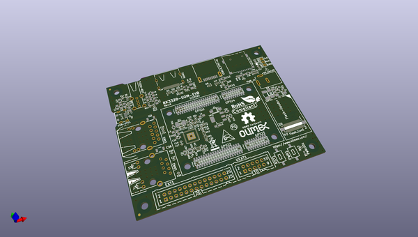

# OOMP Project  
## RK3328-SOM-EBV  by OLIMEX  
  
oomp key: oomp_projects_flat_olimex_rk3328_som_ebv  
(snippet of original readme)  
  
- RK3328-SOM-EVB  
Evaluation board for RK3328-SOM System on modules  
  
Product page: https://www.olimex.com/Products/SOM/RK3328/RK3328-EVB/  
  
-- License  
* Hardware is released under CERN OHL v1.2 license  
* Software is released under GPL3 License  
* Documentation is released under CC BY-SA 3.0  
  
  
  full source readme at [readme_src.md](readme_src.md)  
  
source repo at: [https://github.com/OLIMEX/RK3328-SOM-EBV](https://github.com/OLIMEX/RK3328-SOM-EBV)  
## Board  
  
  
## Schematic  
  
  
  
[schematic pdf](working_schematic.pdf)  
## Images  
