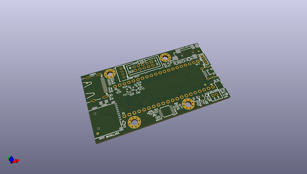

# OOMP Project  
## RP2040-PICO-PC  by OLIMEX  
  
oomp key: oomp_projects_flat_olimex_rp2040_pico_pc  
(snippet of original readme)  
  
- RP2040-PICO-PC  
Board of peripherals for Raspberry Pi RP2040-PICO which adds:  
  
- HDMI/DVI   
- Audio   
- Micro SD card   
- Li-po charger   
- UEXT  
- USB-OTG   
  
Allows to create a small PC with monitor and keyboard.  
  
The RP2040-PICO-PC design is Open-Source Hardware (OSHW).  
  
  full source readme at [readme_src.md](readme_src.md)  
  
source repo at: [https://github.com/OLIMEX/RP2040-PICO-PC](https://github.com/OLIMEX/RP2040-PICO-PC)  
## Board  
  
  
## Schematic  
  
  
  
[schematic pdf](working_schematic.pdf)  
## Images  
