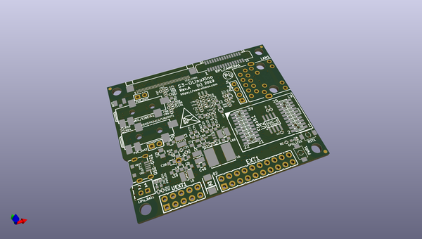

# OOMP Project  
## S3-OLinuXino  by OLIMEX  
  
oomp key: oomp_projects_flat_olimex_s3_olinuxino  
(snippet of original readme)  
  
- S3-OLinuXino  
IP Camera with S3 SOC from Allwinner, PoE 100Mbit, LCD, micro SD, Flash  
  
This board has:  
- Allwinner S3 Cortex-A7 running at 1.2Ghz  
- 1Gb DDR3 RAM inside S3 SOC up to 1333Mhz  
- 100Mb Ethernet interface with PoE option  
- NAND/eMMC/SPI Flash on socket  
- WiFi / BT module with RTL8723BS   
- Audio In and Out  
- UEXT connector  
- Configuration EEPROM  
- LCD connector for LCD-OLinuXino  
- MIPI camera connector  
- CSI camera connector  
- Dimensions: 60 x 50 mm  
  
- License  
- Hardware is with CERN OHL v1.2 license  
- Software is with GPLv3 license  
- Documentation is with CC BY-SA 4.0 license  
  
  full source readme at [readme_src.md](readme_src.md)  
  
source repo at: [https://github.com/OLIMEX/S3-OLinuXino](https://github.com/OLIMEX/S3-OLinuXino)  
## Board  
  
  
## Schematic  
  
  
  
[schematic pdf](working_schematic.pdf)  
## Images  
