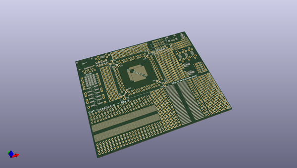

# OOMP Project  
## SMT-PROTOBOARD  by OLIMEX  
  
(snippet of original readme)  
  
- SMT-PROTOBOARD  
PCB prototype board with different SMT footprints  
  
  full source readme at [readme_src.md](readme_src.md)  
  
source repo at: [https://github.com/OLIMEX/SMT-PROTOBOARD](https://github.com/OLIMEX/SMT-PROTOBOARD)  
## Board  
  
  
## Schematic  
  
  
  
[schematic pdf](working_schematic.pdf)  
## Images  
