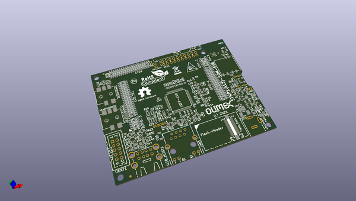

# OOMP Project  
## STMP1-A13-EVB  by OLIMEX  
  
oomp key: oomp_projects_flat_olimex_stmp1_a13_evb  
(snippet of original readme)  
  
- STMP1-A13-EVB  
Evaluation board for STMP15x-SOM and A13-SOM System on modules  
  
Product page: https://www.olimex.com/Products/SOM/STMP1/STMP1-A13--EVB/open-source-hardware  
  
-- License  
* Hardware is released under CERN OHL v1.2 license  
* Software is released under GPL3 License  
* Documentation is released under CC BY-SA 3.0  
  
  
  full source readme at [readme_src.md](readme_src.md)  
  
source repo at: [https://github.com/OLIMEX/STMP1-A13-EVB](https://github.com/OLIMEX/STMP1-A13-EVB)  
## Board  
  
  
## Schematic  
  
  
  
[schematic pdf](working_schematic.pdf)  
## Images  
