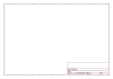
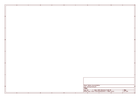

# OOMP Project  
## ok-kicad-libs  by omerk  
  
(snippet of original readme)  
  
- ok-kicad-libs  
KiCad libraries/templates/scripts/etc and notes for myself for when I set up a new install...  
  
-- Setup  
--- Environment variable  
In `Preferences -> Configure Paths`, add `OK_LIB_DIR` environment variable and point to local copy of this repo.  
  
--- Template  
Symlink templates into KiCAD User Templates directory.   
  
On Windows, as admin (as otherwise `mklink` complains):  
```  
cd C:\Users\<<your user>>\Documents\KiCad\6.0\template  
mklink /D ok-project C:\<<ok-kicad-libs local copy>>\templates\ok_project  
```  
  
  
-- Usage  
Create a new project: `File -> New Project from Template -> User Templates -> ok-project`, libraries (and any other settings) will be copied across to the new project created.  
  
  full source readme at [readme_src.md](readme_src.md)  
  
source repo at: [https://github.com/omerk/ok-kicad-libs](https://github.com/omerk/ok-kicad-libs)  
## Board  
  
[](working_3d.png)  
## Schematic  
  
[](working_schematic.png)  
  
[schematic pdf](working_schematic.pdf)  
## Images  
  
[](working_3d.png)  
  
[](working_3d_back.png)  
  
[](working_3D_bottom.png)  
  
[](working_3d_front.png)  
  
[](working_3D_top.png)  
  
[](working_assembly_page_01.png)  
  
[](working_assembly_page_02.png)  
  
[](working_assembly_page_03.png)  
  
[](working_assembly_page_04.png)  
  
[](working_assembly_page_05.png)  
  
[](working_assembly_page_06.png)  
