# OOMP Project  
## vocore-evk  by omerk  
  
oomp key: oomp_projects_flat_omerk_vocore_evk  
(snippet of original readme)  
  
- vocore-evk  
  
An evaluation kit for [VoCore](https://www.indiegogo.com/projects/vocore-a-coin-sized-linux-computer-with-wifi), the coin-sized Linux computer with WiFi.  
  
  
--- Design Status  
  
Alpha (untested!)  
  
--- License  
  
  
  
  
This work is licensed under a [Creative Commons Attribution-ShareAlike 4.0 International License](http://creativecommons.org/licenses/by-sa/4.0/).  
  
  full source readme at [readme_src.md](readme_src.md)  
  
source repo at: [https://github.com/omerk/vocore-evk](https://github.com/omerk/vocore-evk)  
## Board  
  
  
## Schematic  
  
[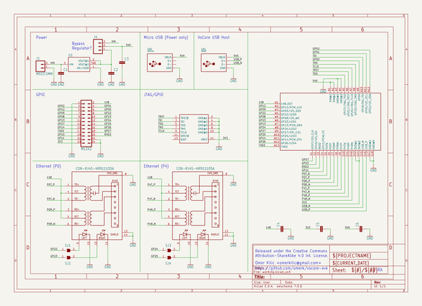](working_schematic.png)  
  
[schematic pdf](working_schematic.pdf)  
## Images  
  
[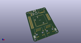](working_3d.png)  
  
[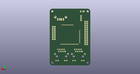](working_3d_back.png)  
  
[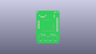](working_3D_bottom.png)  
  
[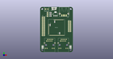](working_3d_front.png)  
  
[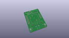](working_3D_top.png)  
  
[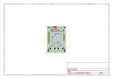](working_assembly_page_01.png)  
  
[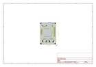](working_assembly_page_02.png)  
  
[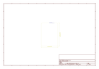](working_assembly_page_03.png)  
  
[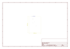](working_assembly_page_04.png)  
  
  
  
[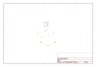](working_assembly_page_06.png)  
