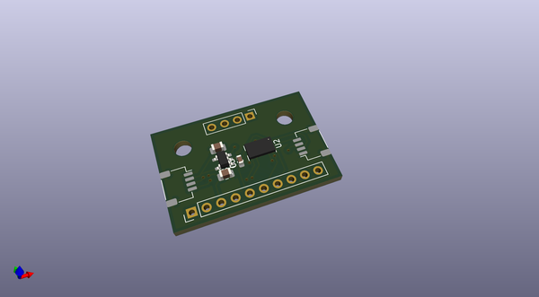
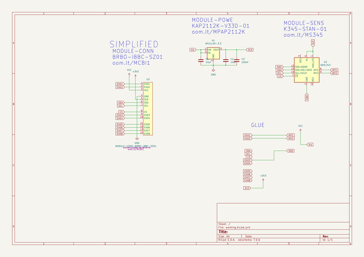
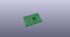
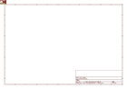
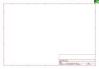
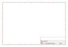
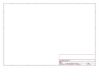
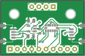

# OOMP Project  
## IBBC_0001  by oomlout  
  
(snippet of original readme)  
  
- IBBC - 0001 - ADXL345 Breakout    
  
  
-- Chips  
  
--- ADXL345 -- SENS-LG14-X-K345-01  
  
https://www.analog.com/en/products/adxl345.html  
https://github.com/oomlout/oomlout_OOMP_parts/tree/main/SENS-LG14-X-K345-01  
  
-- Other Breakouts    
  
	Adafruit  
	https://www.adafruit.com/product/1231  
	https://github.com/adafruit/Adafruit_ADXL345_PCB  
	https://github.com/oomlout/oomlout_OOMP_projects/tree/main/PROJ-ADAF-1231-STAN-01  
	  
	Sparkfun  
	https://www.sparkfun.com/products/9836  
	https://github.com/sparkfun/ADXL345_Breakout  
	https://github.com/oomlout/oomlout_OOMP_projects/tree/main/PROJ-SPAR-9836-STAN-01  
	  
	Analog  
	https://www.analog.com/en/products/adxl345.html-product-evaluationkit  
	https://github.com/oomlout/oomlout_OOMP_projects/tree/main/PROJ-ANLG-0345-STAN-01  
	  
	Seed  
	https://github.com/oomlout/oomlout_OOMP_projects/tree/main/PROJ-SEED-20054-STAN-01  
	  
	  
  full source readme at [readme_src.md](readme_src.md)  
  
source repo at: [https://github.com/oomlout/IBBC_0001](https://github.com/oomlout/IBBC_0001)  
## Board  
  
  
## Schematic  
  
  
  
[schematic pdf](working_schematic.pdf)  
## Images  
  
  
  
  
  
  
  
  
  
  
  
  
  
  
  
  
  
  
