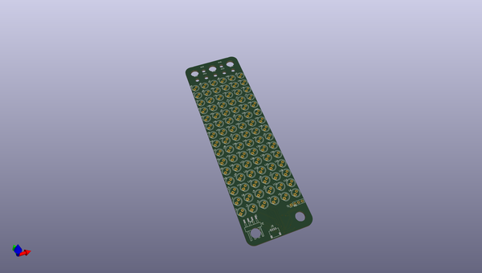
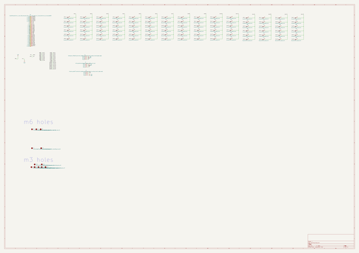
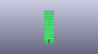
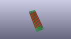
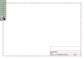
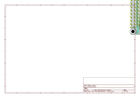
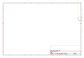
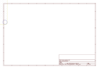
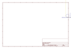
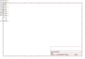

# OOMP Project  
## oomlout_electronics_oobb_led_matrix  by oomlout  
  
(snippet of original readme)  
  
- oomlout_oobb_led_matrix  
  
-- Description  
an electronics project that is an led matrix in the oobb shape, current version is 3 x 10 oobb with 6 columns and 15 rows of leds, it uses the aip1640 16 x 8 driver chip/  
-- Bill of Materials  
| Id | Designator | Footprint | Quantity | Designation | Supplier and ref |  |  
| --- | --- | --- | --- | --- | --- | --- |  
| 1 | L74,L17,L88,L90,L10, L70,L80,L13,L9,L86,L 71,L69,L72,L63,L20,L 87,L58,L42,L16,L79,L 45,L38,L85,L1,L61,L8 9,L4,L50,L75,L3,L76, L27,L7,L64,L35,L12,L 65,L53,L60,L78,L23,L 41,L83,L2,L15,L6,L22 ,L48,L55,L66,L5,L34, L30,L59,L11,L46,L82, L19,L73,L44,L33,L21, L31,L25,L40,L24,L57, L43,L36,L77,L51,L8,L 49,L18,L14,L28,L37,L 81,L29,L52,L84,L56,L 32,L39,L26,L47,L62,L 68,L54,L67 | l5_7297cd_electronic _led_5_mm | 90 | [5 Mm Led](https://github.com/oomlout/oomlout_oomp_v3/tree/main/parts/electronic_led_5_mm) l5 7297cd |  |  |  
| 2 | J3 | h4psmra_adfe77_elect ronic_header_1_mm_js t_sh_4_pin_surface_m ount_right_angle | 1 | [Jst Sh 4 Pin Surface Mount Right Angle Header 1 Mm Pitch](https://github.com/oomlout/oomlout_oomp_v3/tree/main/parts/electronic_header_1_mm_jst_sh_4_pin_surface_mount_right_angle) h4psmra adfe77 |  |  |  
| 3 | J2 | hi14p_abf4a4_electro nic_header_2d54_mm_4 _pin | 1 | [0.1" 4 Pin Header](https://github.com/oomlout/oomlout_oomp_v3/tree/main/parts/electronic_header_2d54_mm_4_pi  
  full source readme at [readme_src.md](readme_src.md)  
  
source repo at: [https://github.com/oomlout/oomlout_electronics_oobb_led_matrix](https://github.com/oomlout/oomlout_electronics_oobb_led_matrix)  
## Board  
  
  
## Schematic  
  
  
  
[schematic pdf](working_schematic.pdf)  
## Images  
  
  
  
  
  
  
  
  
  
  
  
  
  
  
  
  
