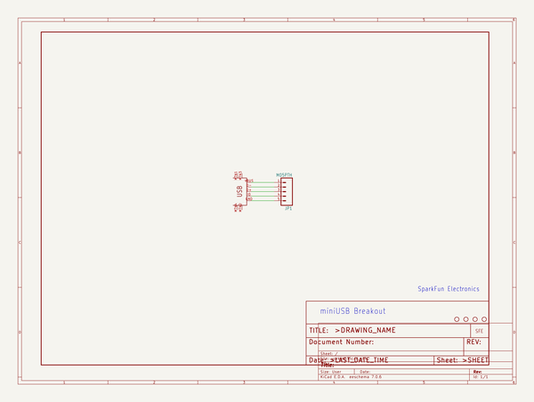
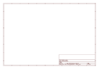
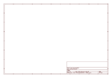

# OOMP Project  
## oomlout_OOMP_projects  by oomlout  
  
oomp key: oomp_projects_flat_oomlout_oomlout_oomp_projects  
(snippet of original readme)  
  
- oomlout_OOMP_projects  
OOpen Organization Method for parts. This is all the project details.  
  
  
--- Project File Process  
  
Note: Adafruit and sparkfun projects are currently in the system without a genesis step. This should be fixed in the future  
  
---- OOMP_projects.py   
  
Run this to generate and harvest all project files  
  
---- OOMP_projects_BASE.py   
  
	* createAllProjects() -- This creates all the projects using the iduvidual company files (ie. OOMP_prohects_IBBC). These files contain where possible, gitrepo details and name only.  
  
----- OOMP_projects_BASE.harvestProjects()  
  
This goes through the created projects and grabs as many details as possible in this order  
  
	* gitPull -- This pulls the project from it's git repo  
	* copyBaseFiles -- This copies the board and schematic files from a git repo to the project folder.   
	* harvestEagle -- Creates kicad files from eagle files. Also generates various eagle renders of the project and outputs details (ie. BOM)(if a project has no git repo you can copy eagle brd and sch files and generation will start from this step onwards)  
	* harvestKicad -- (if a project has no git repo and no eagle files you can copy kicad kicad_pcb and kicad_sch files and generation will start from this step onwards). This is also stage where part extraction and matching happens.  
  
--- Project Files    
  
---- Level 1 (Generated at the first step)  
  
	* details.py -- This is the main file to define a project. It is generated in OOMP_projects_*company*.py. It contains  
  full source readme at [readme_src.md](readme_src.md)  
  
source repo at: [https://github.com/oomlout/oomlout_OOMP_projects](https://github.com/oomlout/oomlout_OOMP_projects)  
## Board  
  
  
## Schematic  
  
  
  
[schematic pdf](working_schematic.pdf)  
## Images  
  
  
  
  
  
  
  
  
  
  
  
  
  
  
  
  
